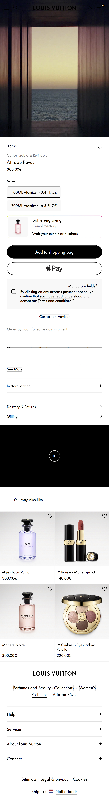
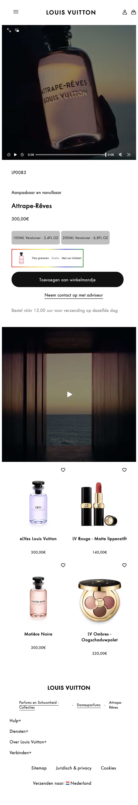

# Procesverslag
Markdown is een simpele manier om HTML te schrijven.  
Markdown cheat cheet: [Hulp bij het schrijven van Markdown](https://github.com/adam-p/markdown-here/wiki/Markdown-Cheatsheet).

Nb. De standaardstructuur en de spartaanse opmaak van de README.md zijn helemaal prima. Het gaat om de inhoud van je procesverslag. Besteedt de tijd voor pracht en praal aan je website.

Nb. Door *open* toe te voegen aan een *details* element kun je deze standaard open zetten. Fijn om dat steeds voor de relevante stuk(ken) te doen.

## Jij

  
uitwerken voor kick-off werkgroep

  ### Auteur:
  Patoune de Rode

  #### Je startniveau:
  Blauw

  #### Je focus:
  Responsive
 

## Je website

  
uitwerken voor kick-off werkgroep

  ### Je opdracht:
  https://en.louisvuitton.com/eng-nl/homepage?dispatchCountry=NL
  https://en.louisvuitton.com/eng-nl/products/attrape-reves-nvprod1160017v/LP0083

  #### Screenshot(s) van de eerste pagina (small screen): 
  homepage
  

  #### Screenshot(s) van de tweede pagina (small screen):
  perfume
  
 

## Toegankelijkheidstest 1/2 (week 1)

  
uitwerken na test in 2e werkgroep

  ### Bevindingen
  Lijst met je bevindingen die in de test naar voren kwamen:

## Breakdownschets (week 1)

  
uitwerken na afloop 3e werkgroep

  ### de hele pagina: 
  

  ### dynamisch deel (bijv menu): 
  

  ### wellicht nog een dynamisch deel (bijv filter): 
  

## Voortgang 1 (week 2)

  
uitwerken voor 1e voortgang

  ### Stand van zaken
  hier dit ging goed & dit was lastig (neem ook screenshots op van delen van je website en code)

  ### Agenda voor meeting
  samen met je groepje opstellen

  | Patoune: Ik wil vragen hoe ik een video erin zet en deze toegankelijk maak
  | Aya: Het programmeren van de agenda functionaliteit, Het animeren van de bewegende paragraaftekst, Het stylen van de productfoto’s, inclusief de animatie op de achtergrond, Het aanpassen van het contrast van de socialmedia iconen.        
   | Kyra:  grid (afbeeldingen en tekst responsive krijgen) en hoe ik een kleine animatie krijg van iets wat geen afbeelding is
    | Randi: vragen over de header  

  ### Verslag van meeting
  hier na afloop snel de uitkomsten van de meeting vastleggen

  - geleerd horizontaal te scrollen
  - grid columns

## Voortgang 2 (week 3)

  
uitwerken voor 2e voortgang

  ### Stand van zaken
  hier dit ging goed & dit was lastig (neem ook screenshots op van delen van je website en code)

  ### Agenda voor meeting
  samen met je groepje opstellen

  Patoune | - hoe ik mijn afbeeldingen horizontaal kon laten scrollen
      Aya | - Of het toegestaan is om 2 images binnen 1 article te hebben, waarvan 1 als achtergrond img.
            - 2 images op de echte website met de juiste kleur downloaden.
            - Hoe ik de contrast van socialmedia iconen met css kan laten veranderen.
    Joost | - Hoe ik mijn nav kan vormgeven als een responsive raster.
            - Kijken naar mijn grid en hoe ik daarin dingen kan gaan plaatsen
     Kyra | - Afbeeldingen positioneren op mijn home page en hoe ik dat in een grid kan doen.
            - Hoe ik de animatie het best kan maken.

 

  ### Verslag van meeting
  hier na afloop snel de uitkomsten van de meeting vastleggen

  - 

## Toegankelijkheidstest 2/2 (week 4)

  
uitwerken na test in 9e werkgroep

  ### Bevindingen
  Lijst met je bevindingen die in de test naar voren kwamen (geef ook aan wat er verbeterd is):

## Voortgang 3 (week 4)

  
uitwerken voor 3e voortgang

  ### Stand van zaken
  hier dit ging goed & dit was lastig (neem ook screenshots op van delen van je website en code)

  ### Agenda voor meeting
  samen met je groepje opstellen
    Patoune | - Hoe zet ik een video in mijn html, met controls en hoe style ik de summary's in mijn footer
      Aya | X
    Randi | X
     Kyra | - Search balk in hamburger menu. cursor laten meebewegen.

  ### Verslag van meeting
  hier na afloop snel de uitkomsten van de meeting vastleggen

  - Hoe ik video's erin zet
  - met controls, autoplay
  - footer stylen

## Eindgesprek (week 5)

  
uitwerken voor eindgesprek

  ### Je uitkomst - karakteristiek screenshots:
  " width="375px" alt="uitomst opdracht 1">

  ### Dit ging goed/Heb ik geleerd: 
  Geleerd met grid alles responsive maken, hamburger menu maken met Javascript en Light en dark mode.

  ### Dit was lastig/Is niet gelukt:
  De pagina tot in detail namaken.

## Bronnenlijst

  
continu bijhouden terwijl je werkt

  Nb. Wees specifiek ('css-tricks' als bron is bijv. niet specifiek genoeg). 
  Nb. ChatGpT en andere AI horen er ook bij.
  Nb. Vermeld de bronnen ook in je code.

  1. /* https://www.handleidinghtml.nl/css/eigenschappen/text-decoration/voorbeelden.html */
  2. /* https://codyhouse.co/nuggets/css-gradient-borders */
  3. ChatGPT over overflow-y en overflow-x

